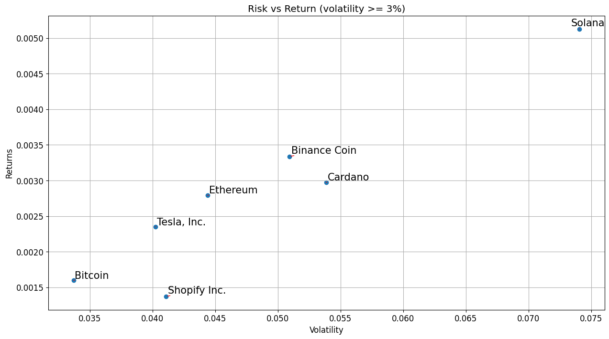

# 📚 FinSight: Financial Asset Clustering and Analysis
**FinSight** is an AI-powered financial analytics project designed to analyze, cluster, and visualize different financial assets based on their return and risk profiles.
It leverages historical data, machine learning, and smart visualization techniques to uncover hidden relationships across stocks, metals, energy, and cryptocurrencies.

# 📈 Tested Asset Portfolio

The application's analysis and insights are currently tested on a diversified portfolio encompassing major financial sectors:

| Sector                      | Assets                                                                    |
|-----------------------------|---------------------------------------------------------------------------|
| **💻 Technology** | AAPL (Apple), MSFT (Microsoft), AMZN (Amazon), SHOP (Shopify), TSLA (Tesla) |
| **🏦 Finance** | JPM (JP Morgan Chase), BAC (Bank of America), BTC-USD (Bitcoin), ETH-USD (Ethereum), SOL-USD (Solana), BNB-USD (Binance Coin), ADA-USD (Cardano) |
| **⚡ Energy** | XOM (ExxonMobil), CVX (Chevron)                                         |
| **⚕️ Healthcare** | JNJ (Johnson & Johnson), PFE (Pfizer)                                     |
| **⛏️ Metals & Mining** | NEM (Newmont Corp), WPM (Wheaton Precious Metals), GLD (Gold ETF), SLV (Silver ETF), BHP (BHP Group) |
| **✈️ Transportation & Defense** | BA (Boeing), LMT (Lockheed Martin), F (Ford Motor Company)                 |

This diverse selection of assets ensures comprehensive coverage across traditional industries, innovative technologies, and alternative investment vehicles such as cryptocurrencies and precious metals.

## 📂 Project Structure (Current Files)
* **app/services/data_fetcher.py** - Script to automatically download and clean historical price data for all assets using the Yahoo Finance API (yfinance). It ensures clean CSVs ready for analysis.
* **notebooks/model_training.ipynb** - Jupyter Notebook that loads the prepared datasets, computes returns, visualizes relationships (dendrograms, risk-return plots), and prepares the data for clustering and future model training (like LSTM, GRU

## 🚀 What's Next?

Stay tuned for upcoming features and enhancements:

* **FastAPI backend:** To serve trained models and analytical insights via robust APIs.
* **Flutter/HTML frontend:** To provide an interactive user interface for exploring financial clusters and forecasts.
* **Machine learning models:** Integration of advanced models (LSTM, GRU, Prophet) for future price predictions.
* **Real-time data:** Implementation of real-time data fetching and streaming updates.

## ✨ Quick Preview

* Clustering financial assets based on historical returns? ✅
* Spotting how crypto moves differently from stocks? ✅
* Understanding risk vs return easily? ✅
* Time Series Prediction with LSTM & GRU? 🚀 In progress...
* Building a smart, scalable financial AI platform? 🚀 In progress...

## 📣 How to Get Started

1.  **Clone the repository**
2.  **Install dependencies** (coming soon in `requirements.txt`)
3.  Run `data_fetcher.py` to download the necessary financial data.
4.  Explore the initial analysis and visualizations by opening and running `notebooks/model_training.ipynb`.

## 📈 Dendrogram Conclusion

<em>Stocks dance together, metals stick close, crypto goes wild — the market's social network, visualized.</em>
* **Tech giants** like Apple, Microsoft, and Amazon cluster tightly together, reflecting their synchronized market movements and mutual dependency on global tech trends.

* **Banks and finance titans** like JPMorgan Chase and Bank of America show strong alignment, reacting similarly to economic cycles and interest rate changes.

* **Metals and mining assets** (Gold, Silver, Wheaton, Newmont) naturally form a cohesive cluster — the classic safe-haven assets that move in tandem during times of market stress.

* **Cryptocurrencies** like Bitcoin, Ethereum, Solana, and Cardano create their own rebellious group — wildly distinct from traditional markets, operating on their own risk universe.

* **Energy titans** Chevron and ExxonMobil also group logically, driven by oil prices and global energy demand.

* **Healthcare and defense stocks** hold their unique positions, less correlated to the broader swings seen elsewhere.

## Return vs Risk (Volatility)

## Key Observations from Risk vs. Return Analysis

When analyzing the risk (volatility) and return characteristics of the assets in our portfolio, several key trends emerge:

* **Low Volatility "Safe Plays":**
    * **Gold (SPDR Gold Trust - GLD)** and **healthcare stocks** (e.g., Johnson & Johnson - JNJ, Pfizer - PFE) exhibit the lowest volatility. These are typically considered stable investments with gradual movements rather than significant daily fluctuations.

* **Balanced Growth: Low Risk Tech Giants:**
    * Major **tech companies** like Microsoft (MSFT), Apple (AAPL), and Amazon (AMZN) demonstrate a favorable balance of decent returns coupled with relatively low risk. This makes them attractive for long-term investors seeking steady growth without excessive volatility.

* **High Risk, High Reward: Crypto Assets:**
    * **Cryptocurrencies** (Bitcoin - BTC-USD, Ethereum - ETH-USD, Solana - SOL-USD, Cardano - ADA-USD, Binance Coin - BNB-USD) stand out with the highest potential returns, but also come with exceptionally high volatility. Investing in this asset class can offer significant rewards but involves navigating substantial price swings.

* **Moderate Risk: Metals and Mining:**
    * **Metals and mining stocks** (e.g., Newmont - NEM, Wheaton Precious Metals - WPM, iShares Silver Trust - SLV) fall into a middle ground. They can provide some hedging against market instability but are not as inherently stable as gold.

* **Mid-to-High Volatility: Energy and Autos:**
    * **Energy companies** (Chevron - CVX, Exxon - XOM) and the **automotive sector** (Ford - F, Tesla - TSLA) tend to show mid-to-high volatility. This reflects their susceptibility to broader economic factors such as oil prices and supply chain disruptions.

